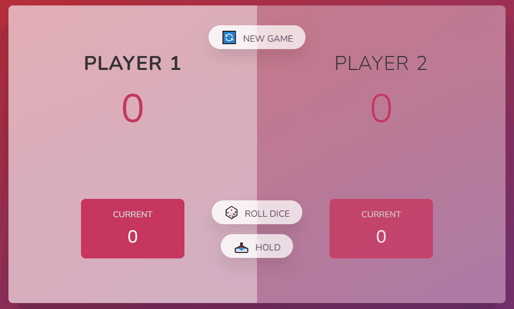

# 🐷 Pig Game

This is a mini game developed in Jonas Schmedtmann's Javascript Course. In it, the first player to reach a certain amount of points (in this case 20) wins the game and every time the 1 falls, the players change turns.

You can test the project and take a look at the course at the links below.
 
🎮 [Test the game !](https://pig-game-v2.netlify.app/)
 
📚 [See the course !](https://www.udemy.com/course/the-complete-javascript-course/)

## 👩🏻 Author

Made with 💜 by Evelyn Monteiro 👋
 

